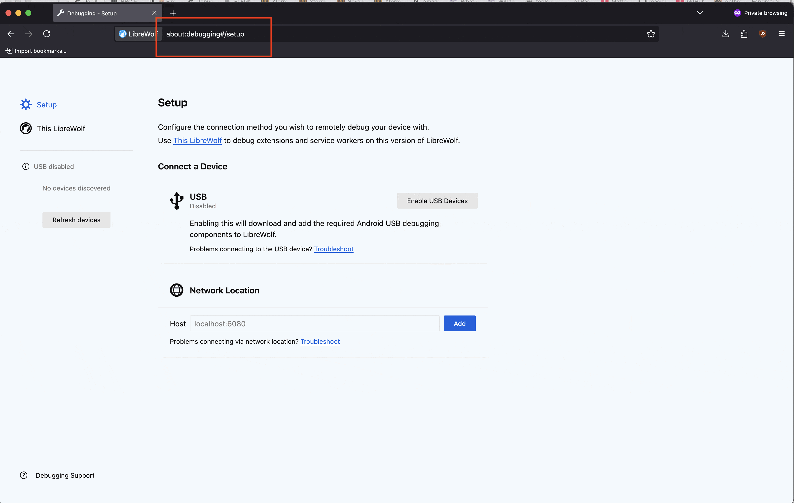

# Web Content Summarization Sidebar for Firefox with Ollama

A Firefox extension that provides a sidebar for summarizing web pages and interacting with locally running LLMs via Ollama.



## Solution Overview

This project consists of two main components:

1. **Firefox Extension**: A sidebar that allows you to:
   - Summarize the current webpage
   - Generate questions about the page content
   - Chat with an AI about the page content
   - Customize system prompts and model settings

2. **Proxy Server**: A Python-based proxy that:
   - Handles CORS issues between the browser and local LLM servers
   - Forwards requests from the extension to Ollama/LM Studio
   - Returns AI responses to the extension

The extension works with locally running LLM models on Ollama, giving you privacy and control over your AI interactions while browsing the web.

## Features

- **Page Summarization**: Get concise summaries of any webpage
- **Suggested Questions**: Generate relevant questions about the page content
- **Chat Interface**: Ask follow-up questions about the page
- **Customizable Settings**: Configure your LLM endpoint, model, and system prompts
- **Auto-summarize**: Option to automatically summarize pages when they load
- **Clean Interface**: Sidebar design that doesn't interfere with browsing

## Prerequisites

- Firefox browser (also tested on LibreWolf)
- Python 3.6+ (for the proxy server)
- Ollama running locally

## Setting Up the Firefox Extension

### Building the Extension

1. Clone this repository:
   ```
   git clone https://github.com/maciejjedrzejczyk/ffxaisidebar
   cd ffxaisidebar
   ```

2. Package the extension:
   - Zip all the extension files (excluding the proxy folder and Docker files):
   ```
   zip -r ffxaisidebar.zip manifest.json background.js content.js sidebar/ icons/ -x "*/\.*"
   ```

### Installing the Extension in Firefox

1. Open Firefox
2. Enter `about:debugging` in the address bar
3. Click "This Firefox"
4. Click "Load Temporary Add-on"
5. Select the `ffxaisidebar.zip` file or the `manifest.json` file from your cloned repository

## Running the Proxy Server

The proxy server is required to bypass CORS restrictions and allow the extension to communicate with your local LLM server.

### Option 1: Running Directly on Host

1. Install the required Python package:
   ```
   pip install requests
   ```

2. Run the proxy server:
   ```
   cd proxy
   python ollama_proxy.py
   ```

3. The proxy will start on port 8765 by default

### Option 2: Running with Docker

1. Build the Docker image:
   ```
   cd proxy
   docker build -t ffxaisidebar .
   ```

2. Run the container:
   ```
   docker run -d --name ffxaisidebar -p 8765:8765 ffxaisidebar
   ```

#### Using Docker Compose

Alternatively, you can use Docker Compose:

1. Start the container:
   ```
   docker-compose up -d
   ```

2. Stop the container:
   ```
   docker-compose down
   ```

## Using the Extension

1. Make sure your LLM server (Ollama or LM Studio) is running
2. Make sure the proxy server is running
3. Click the extension icon in the Firefox toolbar to open the sidebar
4. Configure the settings:
   - For Ollama: Set endpoint to `http://localhost:11434` and your model name (or `http://host.docker.internal:11434` when using the proxy as a Docker container)
5. Navigate to any webpage you want to analyze

### Summarizing Pages

1. Open a webpage
2. Click "Summarize This Page" in the sidebar
3. Wait for the AI to generate a summary

### Generating Questions

1. After loading a page, click "Proposed Questions"
2. The sidebar will display relevant questions about the page
3. Click any question to ask it in the chat

### Chatting About the Page

1. Type your question in the chat input at the bottom of the sidebar
2. Press Enter or click "Send"
3. The AI will respond based on the page content

### Customizing Settings

Click the "Settings" header to expand the settings panel:

- **Endpoint**: URL of your LLM server
- **Model Name**: The model to use (e.g., `llama3` for Ollama)
- **Max Content Length**: Maximum characters to send to the AI
- **System Prompt**: Customize the AI's behavior and instructions
- **Auto-summarize**: Toggle automatic summarization when loading pages

## Troubleshooting

- **"Failed to get page content" error**: Make sure you're on a regular webpage (not a Firefox internal page)
- **No response from AI**: Check that Ollama and the proxy server are running
- **Slow responses**: Try a smaller/faster model or reduce the Max Content Length

## Privacy & Security

This extension:
- Only sends data to your local LLM server, not to any external services
- Requires permissions to read page content for summarization
- Stores settings only in your browser's local storage

## License

[MIT License](LICENSE)

## Acknowledgments

- This project uses [Ollama](https://github.com/ollama/ollama) for local LLM inference
- Inspired by the need for private, local AI assistance while browsing